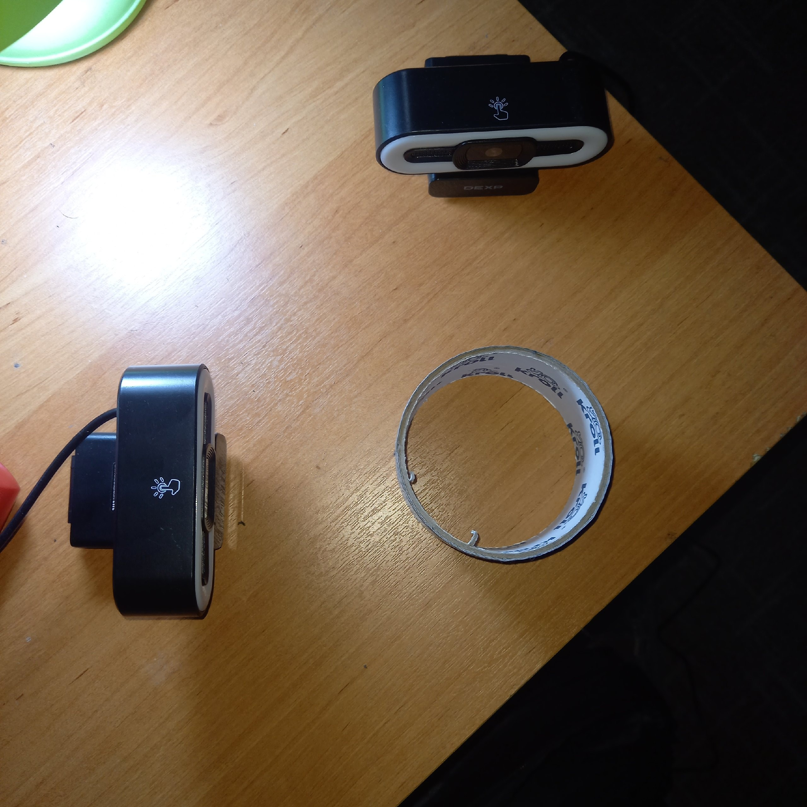
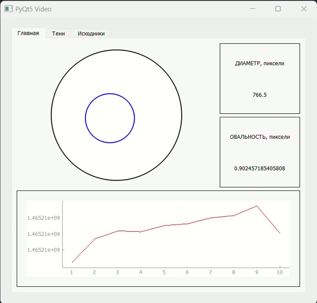

# Визуальный прибор для измерения диаметра электрических кабелей

### Цели проекта:

* Обеспечение высокой точности измерений диаметра электрических кабелей и проволок.
* Улучшение процессов контроля качества на производстве.
* Создание удобного и эффективного инструмента для специалистов в области электротехники.

### Основные преимущества прибора:

* **Точность** : обеспечивает высокую точность измерений для надежного контроля качества продукции.
* **Простота использования** : интуитивный интерфейс делает прибор доступным для широкого круга пользователей.
* **Применение на производстве** : специально разработан для использования на производственных линиях для оперативного контроля качества.

### Применение прибора:

* **Контроль качества на производстве** : обеспечивает непрерывный мониторинг диаметра кабелей и проводов.
* **Точное измерение диаметра материала** : помогает оптимизировать процессы производства и улучшить качество конечной продукции.

### Ожидаемые результаты:

* Улучшение качества производства электрических кабелей.
* Снижение брака и повышение эффективности контроля качества.
* Повышение уровня автоматизации процессов измерения диаметра материала.

### Описание аппаратной части:

- 2 камеры DEXP DQ3M3FA1
- Персональный компьтер под управлением операционной системы Windows 11

2 камеры находятся под углов 90 градусов относительно друг друга и не попадают в поле зрения. В центре данной конструкции должен находится измеряемый предмет.



### Результат:

В итоге получилось такое приложение:



### Описание полученных результатов:

Приложение разделено на три страницы: "Главная", "Тени" и "Исходники".

На странице "Главная" представлены три основные компоненты программы. В частности:

* **Виджет размеров и положения** : отображает размер и расположение измеряемого объекта относительно рабочей зоны прибора, обеспечивая удобное размещение для более простой настройки.
* **Виджет диаметра и овальности** : выводит графический интерфейс с информацией о диаметре и форме объекта.
* **Виджет результатов измерения** : графически отображает полученные результаты измерений.

На странице "Тени" демонстрируется визуализация объекта прибора.

На странице "Исходники" представлены исходные данные, записанные и отображенные без изменений.


### Запуск проекта на вашей платформе:

Проект представляет собой кроссплатформенное приложение, способное функционировать как на операционных системах Windows, так и на Linux.

Для запуска проекта на вашей платформе необходимо выполнить загрузку необходимых библиотек из файла requirements.txt с помощью следующей команды:

```
pip install -r requirements.txt
```

После успешной установки всех необходимых библиотек, запустите основной файл проекта main_qui.py для инициализации приложения.

### Вывод:

В процессе разработки было создано приложение для оптического измерения диаметра. Однако программно-аппаратное решение на данный момент находится на начальной стадии и обладает значительной погрешностью. Для устранения данной проблемы целесообразно провести пересмотр аппаратных средств и самой реализации проекта.
